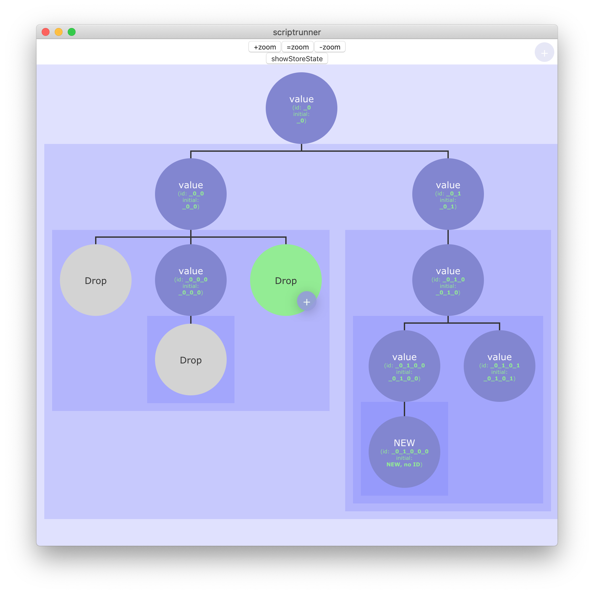

# scriptrunner (or ScriptRunner 😉)

A small desktop app to run scripts ordered in a tree sequence.



## Requirements
**Important Note**: see [extras](#Extras) to see a note about Vue DevTools.

- Requirements
	- ([Node.js](https://nodejs.org/))
	- npm (Should come with node)
	- python 3
	- Used Vue CLI version: [4.2.3](https://github.com/vuejs/vue-cli/releases/tag/v4.2.2) .

## Intro
This project's goal is to create a desktop application to display a tree graph. Each node in the tree represents some program file to be executed. The tree represents the order in which each node will be executed, starting at the root. In this case the root is on top.

This project uses:
- [Vue.js](https://vuejs.org/)
- [Vue CLI](https://cli.vuejs.org/)
- [Vuex](https://vuex.vuejs.org/)
- [Vue Router](https://router.vuejs.org/)
- [Vue CLI Plugin Electron Builder](https://github.com/nklayman/vue-cli-plugin-electron-builder) which in turn uses [electron-builder](https://www.electron.build/)

## Functionalities
This is what this project *should* do (*some parts are already working*):
- Create a graphical tree structure (graph) based on a JSON structure loaded from a file and then managed in the *store* (Vuex).
- Each node from the tree represents a programming block loaded by a file.
- Each node is configurable, allowing changes to:
	- The file called when reaching the node.
	- (In discussion) If the file doesn't have any functions it could be run completely (activated by a checkbox).
	- Allow to select which function of the file should be run.
	- Select if this node (and its children) should be run (checkbox).
- The nodes change color depending on state (ran, not ran, to be run).
- Support these languages:
	- Python 3
	- Matlab
	- R
- Allow zoom (with buttons).
- Show current store (toggle with a button) which should be equal (or similar) to the loaded JSON file.
- Drag and drop nodes to that their parent can be changed.
- Add nodes under another node.
- Add other root nodes, this would create multple trees.
- Add lines to join the bottom of the parent node to the top of a node creating a hierarchical structure.

## Project setup
Using instructions from [Vue CLI Plugin Electron Builder](https://github.com/nklayman/vue-cli-plugin-electron-builder) and from Vue.js.
```bash
# To see the project in action, after getting the files on hard drive (git, download or whatever), run:
npm install

# To start a development server:
# ... If you use Yarn (strongly recommended by nklayman):
yarn electron:serve
# ... or if you use NPM:
npm run electron:serve

# To build your app:
# ... With Yarn:
yarn electron:build
# ... or with NPM:
npm run electron:build
```

## Initial Installation
This is what I did on the initial installation.

### Steps
1. Install Vue CLI.
1. Create a project.
1. Add `electron-builder`.
1. Install `python-shell`.

### Vue CLI install
Install Vue CLI ([Installation | Vue CLI](https://cli.vuejs.org/guide/installation.html)):
```bash
npm install -g @vue/cli
```

### Creating the project
This is how I created the Vue.js project ([Creating a Project | Vue CLI](https://cli.vuejs.org/guide/creating-a-project.html#vue-create)):
```bash
vue create scriptrunner
```
And these are the selections made:
```bash
Vue CLI v4.5.4
? Please pick a preset:
  Default ([Vue 2] babel, eslint)
  Default (Vue 3 Preview) ([Vue 3] babel, eslint)
❯ Manually select features
```
```bash
? Check the features needed for your project:
 ◉ Choose Vue version
 ◉ Babel
 ◯ TypeScript
 ◯ Progressive Web App (PWA) Support
 ◉ Router
 ◉ Vuex
 ◉ CSS Pre-processors
 ◉ Linter / Formatter
❯◉ Unit Testing
 ◯ E2E Testing
```
```
? Choose a version of Vue.js that you want to start the project with
❯ 2.x
  3.x (Preview)
```
```bash
? Use history mode for router? (Requires proper server setup for index fallback in production) (Y/n)
 n
```
```bash
? Pick a CSS pre-processor (PostCSS, Autoprefixer and CSS Modules are supported by default): (Use ar
row keys)
❯ Sass/SCSS (with dart-sass)
  Sass/SCSS (with node-sass)
  Less
  Stylus
```
```bash
? Pick a linter / formatter config:
❯ ESLint with error prevention only
  ESLint + Airbnb config
  ESLint + Standard config
  ESLint + Prettier
```
```bash
? Pick additional lint features: (Press <space> to select, <a> to toggle all, <i> to invert selectio
n)
❯◉ Lint on save
 ◯ Lint and fix on commit
```
```bash
? Pick a unit testing solution:
  Mocha + Chai
❯ Jest
```
```bash
? Where do you prefer placing config for Babel, ESLint, etc.? (Use arrow keys)
❯ In dedicated config files
  In package.json
```
```bash
? Save this as a preset for future projects? (y/N) N
```

### Adding electron-builder
For this project [Vue CLI Plugin Electron Builder](https://github.com/nklayman/vue-cli-plugin-electron-builder) will be used.
```bash
vue add electron-builder
```
This is the selections made:
``` bash
📦  Installing vue-cli-plugin-electron-builder...
(...additional output...)
✔  Successfully installed plugin: vue-cli-plugin-electron-builder

? Choose Electron Version
  ^7.0.0
  ^8.0.0
❯ ^9.0.0
```
``` bash
? Add tests with Spectron to your project? (Y/n) N
```

### Install `python-shell`
This project will run python code called by node, that's why `python-shell` will be used.
```bash
npm i python-shell
```
